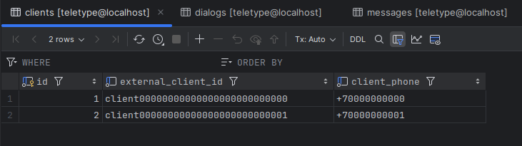
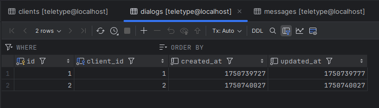
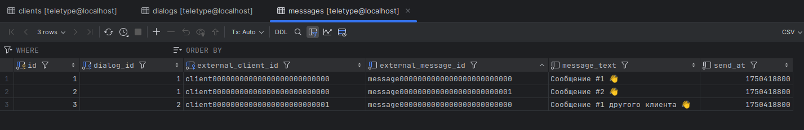

# Примитивное решение задачи

> Роут, на который отправляем запрос:
> ```
> POST http://neo-teletype.app/api/v1/messages
> ```
> 
> В теле запроса:
>```json
>{
>  "external_message_id": "message0000000000000000000000000",
>  "external_client_id": "client00000000000000000000000000",
>  "client_phone": "+70000000000",
>  "message_text": "Сообщение #1 👋",
>  "send_at": 1750418650
>}
>```

## 👉 **Postman** (тестовый внешний источник - отправка по одному сообщению)

Отправляем первое Сообщение.

Сообщение успешно добавляется в БД, равно как и создается Клиент, а так же диалог для него. Система возвращает информацию об успешном добавлении Сообщения:
```json
{
  "success": true,
  "data": {
    "external_client_id": "client00000000000000000000000000",
    "dialog_id": 1,
    "external_message_id": "message0000000000000000000000000",
    "message_text": "Сообщение #1 👋",
    "send_at": 1750418650,
    "id": 1
  },
  "errors": []
}
```

При повторной отправке Сообщения с повторяющимся `message_id`, Сообщение не будет добавлено в БД, но запись в лог мы сделаем. Система вернёт соответствующую информацию:
```json
{
  "success": false,
  "data": null,
  "errors": {
    "external_message_id": [
      "Дубликат сообщения!"
    ]
  }
}
```
Отправляем **второе** Сообщение от того же Клиента (меняем `message_id` и для наглядности текст Сообщения):
```json
{
  "external_message_id": "message0000000000000000000000001",  // <-
  "external_client_id": "client00000000000000000000000000",
  "client_phone": "+70000000000",
  "message_text": "Сообщение #2 👋", // 👈
  "send_at": 1750418750
}
```
Сообщение добавлено в базу, **система вернула нужный нам результат**:
```json
{
  "success": true,
  "data": {
    "external_client_id": "client00000000000000000000000000",
    "dialog_id": 1,
    "external_message_id": "message0000000000000000000000001",
    "message_text": "Сообщение #2 👋",
    "send_at": 1750418750,
    "id": 2
  },
  "errors": []
}
```
В базе данных появилось **новое сообщение** (итого - их уже 2), привязанное к клиенту `id = 1` и `external_client_id = client00000000000000000000000000`, при этом диалог для данного клиента обновился, что можно наблюдать в поле `updated_at`. Ожидаемо, записи в таблице `clients` и `dialogs` остались в единственном числе (Клиент = 1, Диалог = 1). 

Пытаемся вновь отправить сообщение с тем же `message_id` и ожидаемо видим информацию о дубликате. Записали в лог, отбросили, пошли дальше 😉 

Аналогично, и в случае с неполными данными, например, пытаемся отправить тело запроса вида: 
```json
{
  "external_message_id": "message0000000000000000000000001",
  "external_client_id": "client00000000000000000000000000"
}
```
Видим информативную ошибку валидации: 
```json
{
  "success": false,
  "data": null,
  "errors": {
    "client_phone": [
      "Client Phone cannot be blank."
    ],
    "message_text": [
      "Message Text cannot be blank."
    ],
    "send_at": [
      "Send At cannot be blank."
    ]
  }
}
```
Естественно, такое сообщение мы пропустим (в БД НЕ запишем), но залоггируем ☝️

Для чистоты экперимента отправим новое сообщение от Другого Клиента:
```json
{
  "external_message_id": "message0000000000000000000000000",
  "external_client_id": "client00000000000000000000000001",  //👈
  "client_phone": "+70000000001", // 👈
  "message_text": "Сообщение #1 другого клиента 👋", // 👈
  "send_at": 1750418800
}
```
Получаем результат:
```json
{
  "success": true,
  "data": {
    "external_client_id": "client00000000000000000000000001",
    "dialog_id": 2,
    "external_message_id": "message0000000000000000000000000",
    "message_text": "Сообщение #1 другого клиента 👋",
    "send_at": 1750418800,
    "id": 3
  },
  "errors": []
}
```
В БД теперь хранится Два Клиента, Два соответсвующих Диалога и Три Сообщения:

###### Клиенты:


###### Диалоги:


###### Сообщения:
